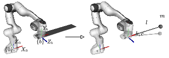
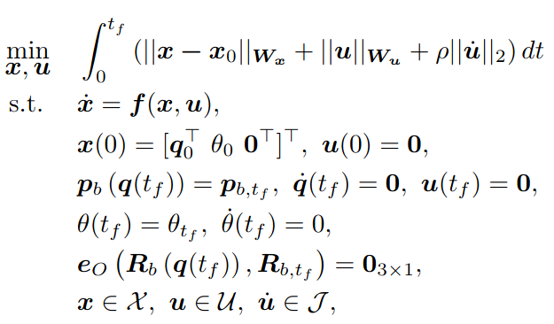

# An optimal open-loop strategy for handling a flexible beam with a robot manipulator

## Introduction
If flexible objects such as beams are handled like rigid body objects, then large vibrations are induced in the system.   


https://user-images.githubusercontent.com/59015432/197711947-49427a9d-6a3e-4290-83bf-c3890ad6703d.mp4


## Getting started
1. Install required packges listed in `requirements.txt` (`beam_handling_py` folder)
2. Install python package by running `pip install -e .` from `beam_handling_py` folder
3. Build beam handling catkin workspace (`beam_handling_ws`) to use RViz for visualizing the trajectory of the robot
3. Run `optimal_handling.py`

## Point-to-point trajectory optimization
We formulate point-to-point trajectory design as an optimization problem (OCP). OCP requires a model of the system. Under some assumption we model the manipulator as a double integrator. The beam, we approximate as a simple pendulum attached to the end-effector of the robot via a passive compliant revolute joint. 



Given the model and the task, we formulate the OCP as follows:



The problem is described in detail in the paper. 

## Citing
To cite our paper in your academic research, please use the following bibtex line:
```bibtex
@article{mamedov2022OBH,
  title={An optimal open-loop strategy for handling a flexible beam with a robot manipulator},
  author={Mamedov, Shamil and Astudillo, Alejandro and Ronzani, Daniele and Decr{\'e}, Wilm and No{\"e}l, Jean-Philippe and Swevers, Jan},
  journal={arXiv preprint arXiv:2210.00578},
  year={2022}
}
```
